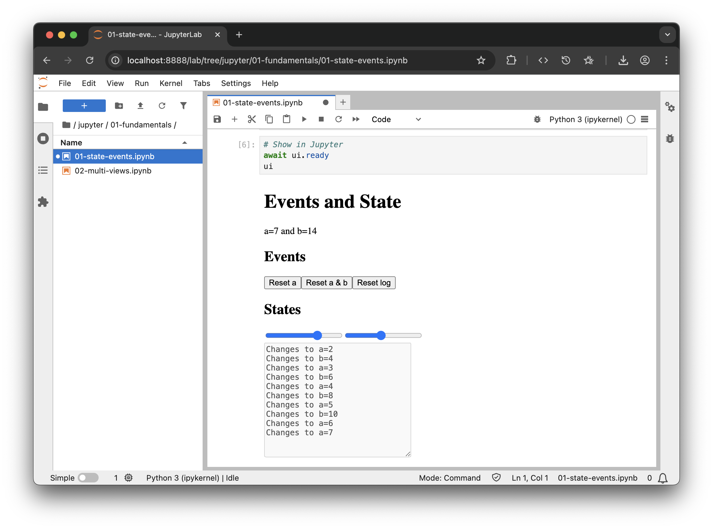

# Hands on

## Virtual Environment

Create a virtual enviroment so you can run it

```bash
uv venv -p 3.10
source .venv/bin/activate
uv pip install trame jupyterlab
```

## Option 1 (repo)

### Fetching the code from repository

```bash
git clone git@github.com:Kitware/sc25-trame-tutorial.git
cd sc25-trame-tutorial/
```

### Run example

```bash
cd ./python/01-fundamentals
jupyter lab
# => Open  ./python/01-fundamentals/01-state-events.ipynb
```

## Option 2 (copy/paste)

### Run Jupyter Lab

```bash
jupyter lab
```
### Fill and run cells


::: code-group

```python [#1 Setup]
from trame.app import get_server
from trame.widgets import html
from trame.ui.html import DivLayout

server = get_server()
```

```python [#2 ViewModel]
# ViewModel
state = server.state

# Read/Write
state.a = 1
state["b"] = state.a * 2
assert state.b == state["b"]


# Reactivity
@state.change("a")
def update_b(a, **_):
    state.b = int(a) * 2


@state.change("a", "b")
def update_log(**_):
    msg = ["\nChanges to"]
    for var_name in state.modified_keys & {"a", "b"}:
        msg.append(f"{var_name}={state[var_name]}")

    state.log += " ".join(msg)


@state.change("log")
def trim_log(log, **_):
    lines = log.split("\n")
    if len(lines) > 10:
        state.log = "\n".join(lines[-10:])
```

```python [#3 Model]
# Model
def reset_a():
    state.a = 10
```

```python [#4 View]
# View
with DivLayout(server) as ui:
    html.H1("Events and State")

    html.Div("a={{ a }} and b={{ b }}")

    html.H2("Events")

    html.Button("Reset a", click=reset_a)
    html.Button("Reset a & b", click="setAll({ b:2, a:1 })")
    html.Button("Reset log", click="log = ''")

    html.H2("States")

    html.Input(type="range", min=0, max=10, v_model="a")
    html.Input(type="range", min=0, max=30, v_model="b")

    html.Br()

    html.Textarea(
        v_model=("log", ""),
        disabled=True,
        rows=12,
        style="width: 15rem;",
    )
```

```python [#5 Show Jupyter]
# Show in Jupyter
await ui.ready
ui
```

```python [#6 Extra]
# Edit state from jupyter
with state:
    state.a = 5
```

:::


## Option 3 (Binder)

[](https://mybinder.org/v2/gh/Kitware/sc25-trame-tutorial/HEAD?urlpath=%2Fdoc%2Ftree%2Fjupyter%2F01-fundamentals%2F01-state-events.ipynb)


## Result 




