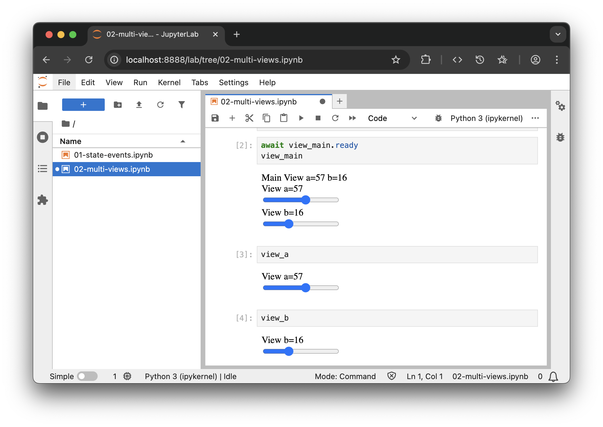

# Hands on

## Option 1 (repo)


### Open example

```bash
./python/01-fundamentals/02-multi-views.ipynb
```

## Option 2 (copy/paste)

### Run Jupyter Lab

```bash
jupyter lab
```

### Fill and run cells

::: code-group

```python [#1 Views]
from trame.app import get_server
from trame.widgets import html, client
from trame.ui.html import DivLayout

server = get_server()

# Main view
with DivLayout(server, height=110) as view_main:  # template_name="main"
    html.Div("Main View a={{a}} b={{b}}")
    client.ServerTemplate(name="view_a")
    client.ServerTemplate(name="view_b")

# view_a
with DivLayout(server, height=50, template_name="view_a") as view_a:
    html.Div("View a={{a}}")
    html.Input(
        type="range",
        min=0,
        max=100,
        step=1,
        v_model=("a", 0),  # Set a default value of 0 to variable "a"
    )

# view_b
with DivLayout(server, height=50, template_name="view_b") as view_b:
    html.Div("View b={{b}}")
    html.Input(
        type="range",
        min=0,
        max=50,
        step=2,
        v_model=("b", 2),  # Set a default value of 0 to variable "b"
    )
```

```python [#2 Main view]
await view_main.ready
view_main
```

```python [#3 View A]
view_a
```

```python [#4 View B]
view_b
```

:::

## Option 3 (Binder)

[](https://mybinder.org/v2/gh/Kitware/sc25-trame-tutorial/HEAD?urlpath=%2Fdoc%2Ftree%2Fjupyter%2F01-fundamentals%2F02-multi-views.ipynb)


## Result


