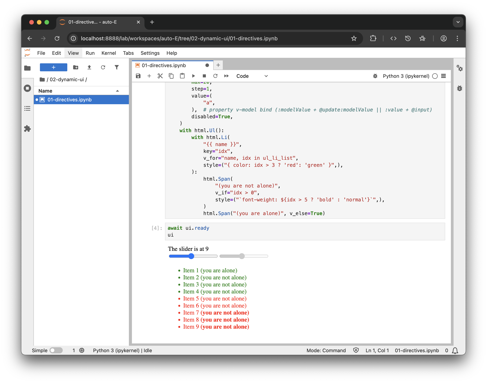

# Hands on

## Option 1 (repo)

### Open example

```bash
./jupyter/02-dynamic-ui/01-directives.ipynb
```

## Option 2 (copy/paste)


### Run Jupyter Lab

```bash
jupyter lab
```

### Fill and run cells


::: code-group

```python [#1 Setup]
from trame.app import get_server
from trame.widgets import html
from trame.ui.html import DivLayout

server = get_server()
```

```python [#2 State handling]
state = server.state

@state.change("a")
def update_b(a, **_):
    state.ul_li_list = [f"Item {i + 1}" for i in range(int(a))]
```

```python [#3 View]
with DivLayout(server, height=300) as ui:
    html.Div("The slider is at {{ a }}")
    html.Input(
        type="range",
        min=0,
        max=20,
        step=1,
        v_model=("a", 0),  # Set a default value of 0 to variable "a"
    )
    html.Input(
        type="range",
        min=0,
        max=20,
        step=1,
        value=(
            "a",
        ),  # property v-model bind (:modelValue + @update:modelValue || :value + @input)
        disabled=True,
    )
    with html.Ul():
        with html.Li(
            "{{ name }}",
            key="idx",
            v_for="name, idx in ul_li_list",
            style=("{ color: idx > 3 ? 'red': 'green' }",),
        ):
            html.Span(
                "(you are not alone)",
                v_if="idx > 0",
                style=("`font-weight: ${idx > 5 ? 'bold' : 'normal'}`",),
            )
            html.Span("(you are alone)", v_else=True)
```

```python [#4 Show UI]
await ui.ready
ui
```

:::

## Option 3 (Binder)

[](https://mybinder.org/v2/gh/Kitware/sc25-trame-tutorial/HEAD?urlpath=%2Fdoc%2Ftree%2Fjupyter%2F02-dynamic-ui%2F01-directives.ipynb)


## Result



