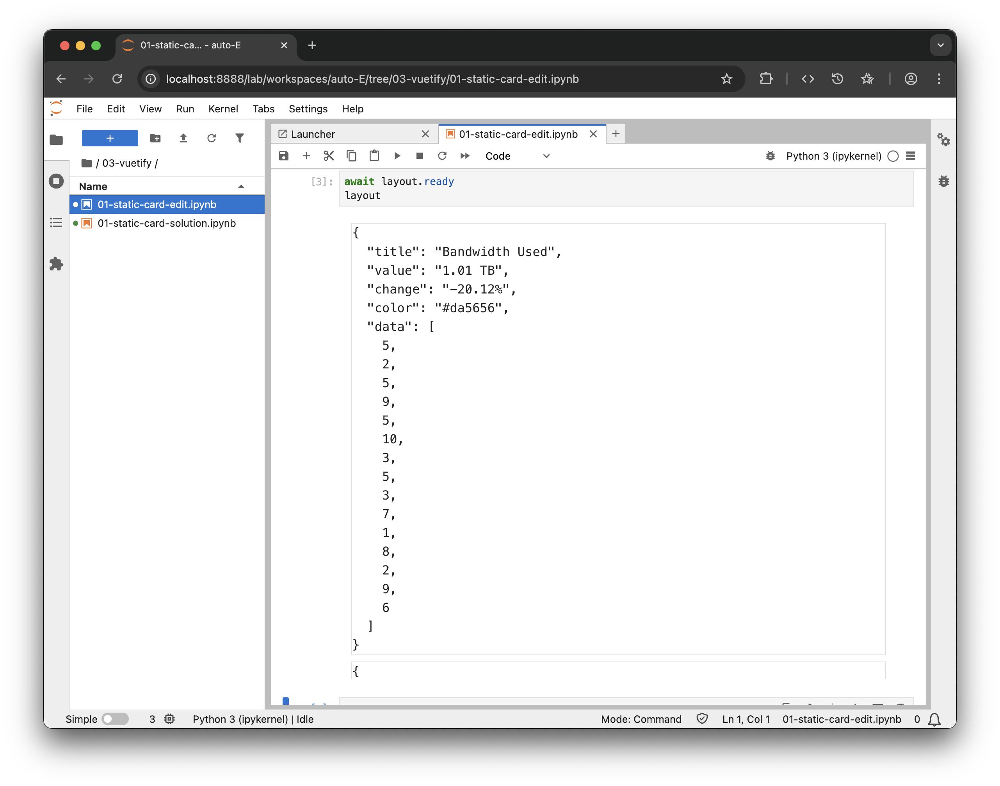
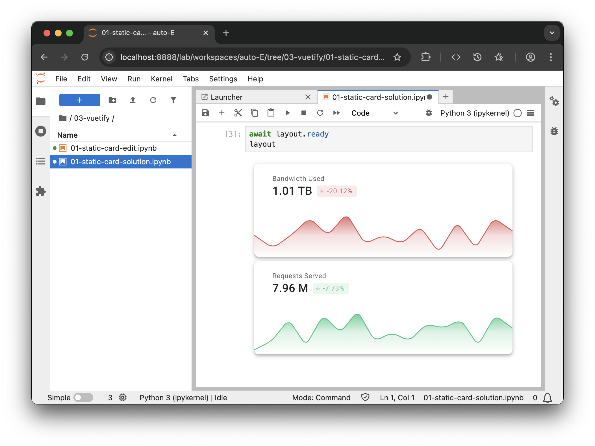

# From the playground to trame

Don't forget to install the vuetify library for trame inside your virtual environemnt.

```bash
uv pip install trame-vuetify
```

## Option 1 (repo)

### Open example

```bash
./jupyter/03-vuetify/01-static-card-edit.ipynb
```


## Option 2 (copy/paste)

### Run Jupyter Lab

```bash
jupyter lab
```

### Fill and run cells


::: code-group

```python [#1 Setup]
from trame.app import get_server
from trame.ui.vuetify3 import VAppLayout
from trame.widgets import html, vuetify3 as v3

server = get_server()
```

```python [#2 ViewModel]
# ViewModel 
state = server.state

state.cards = [
    {
        "title": "Bandwidth Used",
        "value": "1.01 TB",
        "change": "-20.12%",
        "color": "#da5656",
        "data": [5, 2, 5, 9, 5, 10, 3, 5, 3, 7, 1, 8, 2, 9, 6],
    },
    {
        "title": "Requests Served",
        "value": "7.96 M",
        "change": "-7.73%",
        "color": "#2fc584",
        "data": [1, 3, 8, 2, 9, 5, 10, 3, 5, 3, 7, 6, 8, 2, 9, 6],
    },
]
```

```python [#3 UI to edit]
# View 
with VAppLayout(server) as layout:
    with v3.VContainer():
        with v3.VRow(dense=True):
            with v3.VCol(v_for="(card, i) in cards", key="i", cols=12, md=4):
                html.Pre("{{ JSON.stringify(card, null, 2) }}", classes="border-thin")
                # Use App.vue template content and convert it to Python
```


```python [#4 Display]
await layout.ready
layout
```
:::

## Option 3 (Binder)

[](https://mybinder.org/v2/gh/Kitware/sc25-trame-tutorial/HEAD?urlpath=%2Fdoc%2Ftree%2Fjupyter%2F03-vuetify%2F01-static-card-edit.ipynb)


## Result



## Hands on exercise

Edit the file using the code from the playground so it can look like that.


