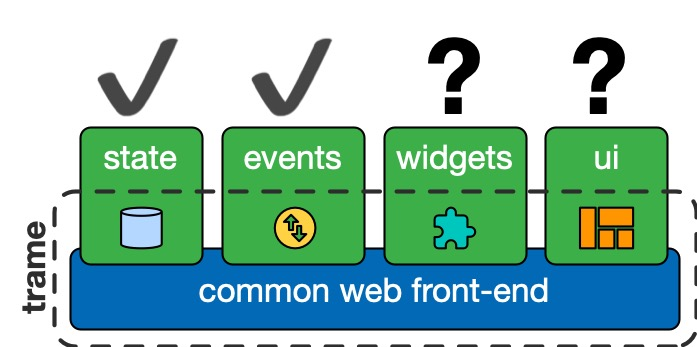

# Fundamentals

- __Widgets__
  - Any element that compose the UI.
  - This can be an HTML element or a composition of HTML elements.
  - i.e. Slider, Button, Plotly figure, VTK 3D view, xTerm, VS Code Editor, Interactive map…
- __UI__
  - A root widget or a view containing widgets.
  - You can have more than one view/ui.
  - A view/ui can be included into another view using the widget trame.widget.client.ServerTemplate
  - A view can be overridden.

