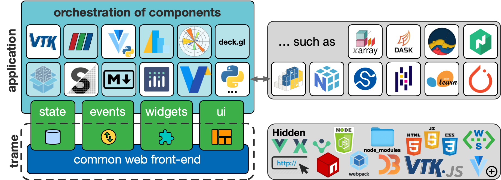

# What is trame?

Trame aims to be __simple__, __powerful__ and __ubiquitous__.

- __Simple__ because all the logic and UI definition can be done in plain Python.
- __Powerful__ because Python has many libraries for scientific data visualization and AI (numpy, plotly, matplolib, VTK, pytorch...).
- __Ubiquitous__ because the same code can runs on laptops, desktops, clusters, and the cloud while displaying everywhere (phone, tablet, laptop, workstation).

## What it is not?

- __Another stateless backend framework__
  - Take ideas from Dash and Streamlit but go beyond by enabling infinite possibilities while reducing integration/maintenance cost.
- __Another visualization/data analytic library__
  - It does not create something new, but enable interactive interaction with existing libraries like VTK, Plotly, matplotlib and more.
- __Another JavaScript frontend framework__
  - Only expect Vue.js components/plugins without any API constraint or trame specificity.