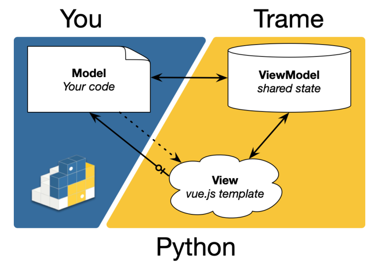
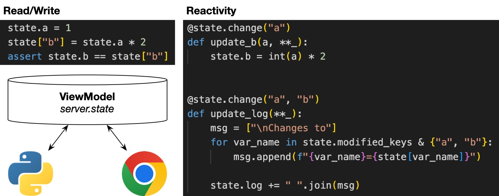
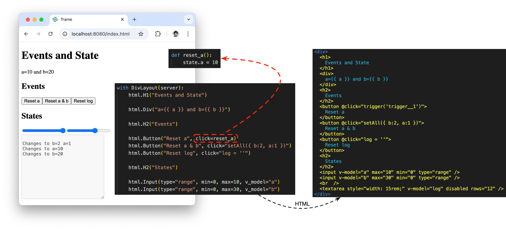
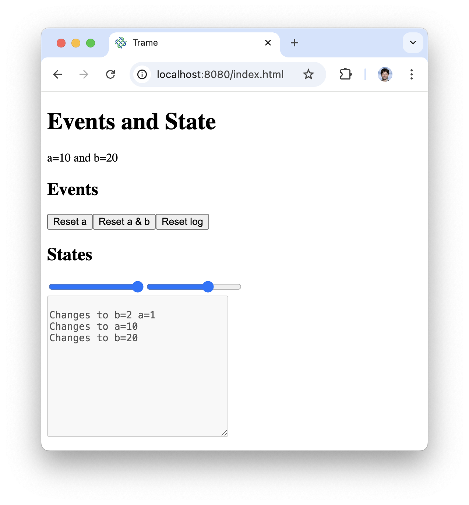

# MVVM Pattern

The MVVM (Model-View-ViewModel) pattern is a software architectural design pattern that separates an application into three interconnected components: the Model, the View, and the ViewModel. This separation facilitates code organization, improves testability, and makes it easier to maintain and expand applications. 

## The split

- Model
  - Your business (trame does not care)
- ViewModel
  - Reactive data model that drives the presentation layer
  - The __Model__ can react to changes and modify it
  - The __View__ reflect its state and can modify it
- View
  - Present the __ViewModel__ into a graphical form
  - The __Model__ can connect actions to events (click, mouse)

## ViewModel

Dictionary like structure to store data to present in the view. The data needs to be serializable.

## View

Template language (html/vue) in Python to ease data and event binding.

## Full application

::: code-group

<<< ../../../code/01-fundamentals/01-state-events.py [Full Application]
<<< ../../../code/01-fundamentals/01-state-events.py {1-6,70-71} [Trame setup]
<<< ../../../code/01-fundamentals/01-state-events.py {8-37} [ViewModel]
<<< ../../../code/01-fundamentals/01-state-events.py {39-42} [Model]
<<< ../../../code/01-fundamentals/01-state-events.py {44-69} [View]
