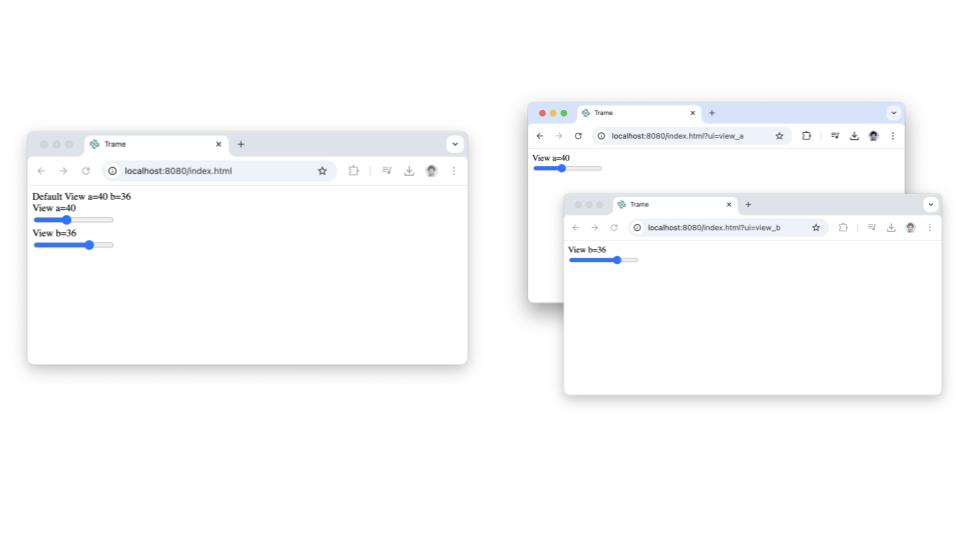

# Hands on

## Option 1 (repo)


### Run example

```bash
python ./code/01-fundamentals/02-multi-views.py
```

## Option 2 (copy/paste)

### Create file with content

Create a file `02-multi-views.py` and paste the content below into it.

<<< ../../../code/01-fundamentals/02-multi-views.py

### Run example

```bash
python 01-state-events.py
```

## Result

::: code-group

``` [Main page]
http://localhost:8080/
```

``` [View A]
http://localhost:8080/?ui=view_a
```

``` [View B]
http://localhost:8080/?ui=view_b
```




