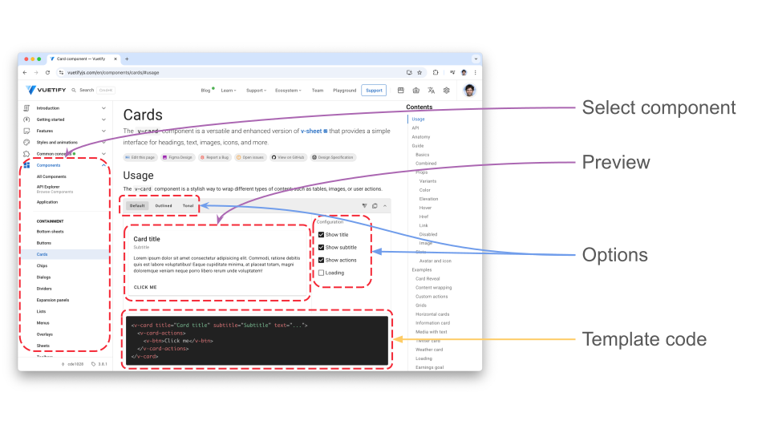

# Vuetify for beautiful UI

Vuetify is a no design skills required Open Source UI Library with beautifully handcrafted Components.

Get started with Vuetify, the world’s most popular Vue.js framework for building feature rich, blazing fast applications.

## From basic to pretty

First learn how to use the [documentation](https://vuetifyjs.com/en/components/cards/#usage) and how you can figure out the property to use to make your element pretty.

