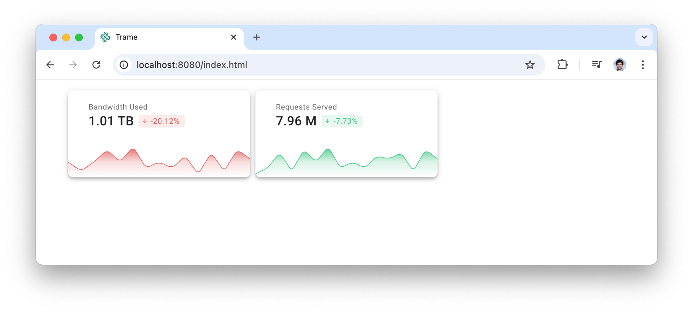

# From the playground to trame

Don't forget to install the vuetify library for trame inside your virtual environemnt.

```bash
uv pip install trame-vuetify
```

## Option 1 (repo)

### Run example

```bash
python ./code/03-vuetify/01-static-card-edit.py
```

## Option 2 (copy/paste)

### Create file with content

Create a file `01-static-card-edit.py` and paste the content below into it.

<<< ../../../code/03-vuetify/01-static-card-edit.py

### Run example

```bash
python 01-static-card-edit.py
```

## Result


## Hands on exercise

Edit the file using the code from the playground so it can look like that.


