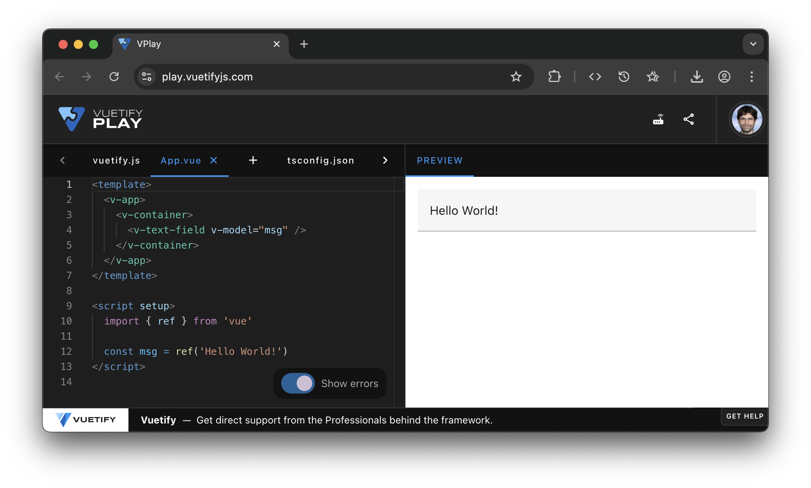
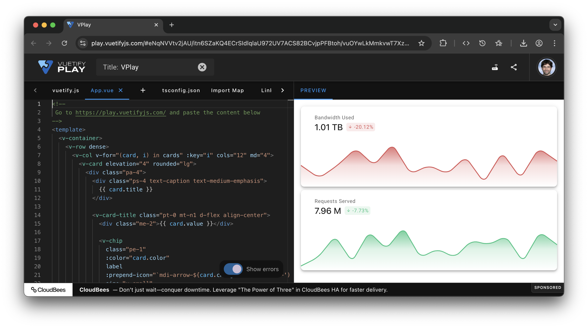

# Using Vuetify playground

The vuetify [playground](https://play.vuetifyjs.com/) let you write your user interface using the vue template syntax and directly see the results.

## Make some pretty statistic cards

<<< ../../../code/03-vuetify/App.vue

