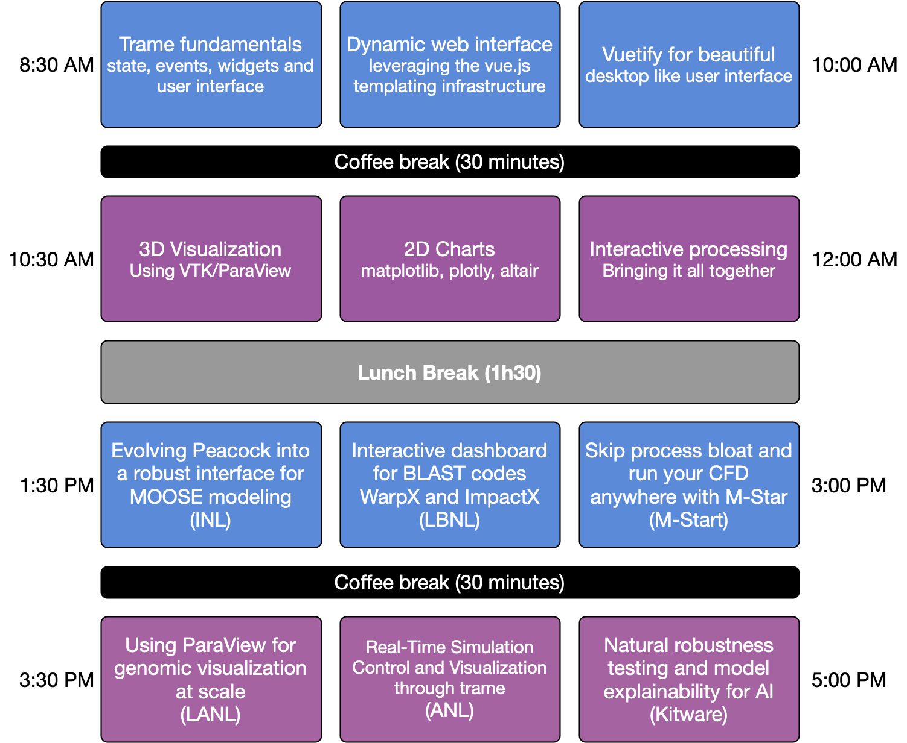

# Schedule

In this hands-on tutorial, participants will learn to create bespoke scientific visualization applications using Trame, a powerful Python framework for building interactive, web-based visualization frontends. Trame simplifies web-based application development by managing UI layout, state, events, and widgets entirely in Python—abstracting away the need to write HTML, CSS, or JavaScript. Trame wraps popular visualization engines like VTK and ParaView, allowing users to rapidly develop rich applications that run seamlessly across web browsers, Jupyter notebooks, and desktop environments—ideal for HPC-enabled simulations, experimental workflows, and AI-driven data analysis. The tutorial will introduce how to design responsive and modern GUIs using Vuetify through Trame’s declarative Python syntax, enabling sophisticated layouts, widgets, and event handling. We will present how to integrate 3D visualization using VTK and ParaView, showcasing different rendering modalities for the interactive exploration of complex datasets. Together, we will explore integrating Markdown content and common Python plotting libraries—including Matplotlib, Altair, PyVista, and Plotly—into Trame applications to support a broad spectrum of scientific visualization needs. We will cover both intermediate and advanced topics, leveraging modern examples drawn from simulation, experimental science, and AI-driven analysis to ground the material in real-world workflows. By the end, participants will be equipped to build tailored visualization applications that bridge HPC backends with intuitive, interactive frontends, all from within the Python ecosystem.

*Each section topic is 30 minutes.